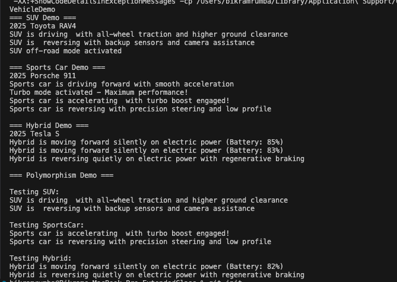

# Vehicle Inheritance Demo

A Java program demonstrating object-oriented programming concepts including inheritance, method overriding, and polymorphism through a vehicle hierarchy system.

## Overview

This project implements a base `Vehicle` class with three specialized subclasses (`SUV`, `SportsCar`, and `Hybrid`) that demonstrate different behaviors while sharing common functionality.

## Class Structure

```
Vehicle (Base Class)
├── SUV
├── SportsCar
└── Hybrid
```

## Features

### Vehicle (Base Class)
- Basic forward and reverse movement
- Common properties: make, model, year
- Provides foundation for all vehicle types

### SUV Class
- **Inheritance**: Extends Vehicle class
- **Override**: Custom forward/reverse behavior with all-wheel drive capabilities
- **Special Feature**: Off-road mode activation
- **Characteristics**: Higher ground clearance, backup sensors

### SportsCar Class
- **Inheritance**: Extends Vehicle class
- **Override**: Performance-focused movement with turbo capabilities
- **Special Feature**: Turbo mode activation
- **Characteristics**: Rapid acceleration, precision handling

### Hybrid Class
- **Inheritance**: Extends Vehicle class
- **Override**: Dual power system (electric/gasoline) behavior
- **Special Features**: Battery management, regenerative braking
- **Characteristics**: Silent electric operation, energy efficiency

## Programming Concepts Demonstrated

- **Inheritance**: All classes extend from Vehicle
- **Method Overriding**: Each subclass overrides forward() and reverse()
- **Polymorphism**: Vehicle array can hold different subclass objects
- **Encapsulation**: Protected and private field access
- **Constructor Chaining**: super() calls to parent constructor

## File Structure

```
VehicleDemo.java
├── Vehicle class
├── SUV class
├── SportsCar class
├── Hybrid class
└── VehicleDemo class (main method)
```

## How to Run

### Prerequisites
- Java Development Kit (JDK) 8 or higher
- Command line access or Java IDE

### Compilation and Execution

1. **Compile the program:**
   ```bash
   javac VehicleDemo.java
   ```

2. **Run the program:**
   ```bash
   java VehicleDemo
   ```

### Expected Output

The program will demonstrate:
1. Individual vehicle behaviors (SUV, SportsCar, Hybrid)
2. Unique features of each vehicle type
3. Polymorphic behavior using a Vehicle array

## Sample Output



## Key Learning Points

1. **Inheritance** allows code reuse and establishes "is-a" relationships
2. **Method Overriding** enables specialized behavior in subclasses
3. **Polymorphism** allows treating different objects uniformly
4. **Encapsulation** protects data integrity through access modifiers

## Customization Ideas

- Add more vehicle types (Truck, Motorcycle, Bus)
- Implement additional methods (start(), stop(), honk())
- Add interfaces for common behaviors (Chargeable, Refuelable)
- Include more detailed vehicle specifications
- Add exception handling for invalid operations

## Author

Created as an educational demonstration of Java OOP concepts.

## Version

1.0 - Initial implementation with basic inheritance and method overriding